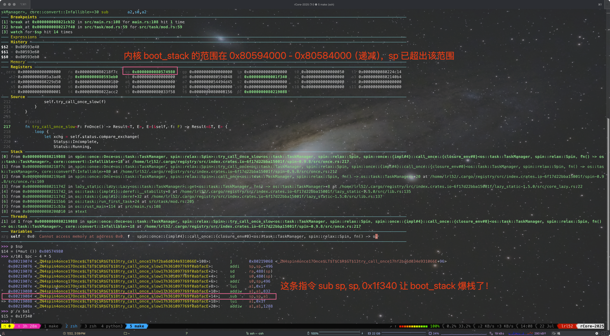

这个 BUG 搞了我大半天，害得我晚上都睡不了觉

BUG 描述：
在 TaskManagerInner 中添加了 `syscall_count: [[isize; MAX_SYSCALL_NUM]; MAX_APP_NUM]` 字段，并通过 lazy_static! 宏一起初始化，
```rust
lazy_static! {
pub static ref TASK_MANAGER: TaskManager = {
        println!("init TASK_MANAGER");
        let num_app = get_num_app();
        println!("num_app = {}", num_app);
        let mut tasks: Vec<TaskControlBlock> = Vec::new();
        for i in 0..num_app {
            tasks.push(TaskControlBlock::new(get_app_data(i), i));
        }
        TaskManager {
            num_app,
            inner: unsafe {
                UPSafeCell::new(TaskManagerInner {
                    tasks,
                    current_task: 0,
                    syscall_count: [[0; MAX_SYSCALL_NUM]; MAX_APP_NUM],
                })
            },
        }
    };
}
```
当编译**开启 debug 选项**时，启动 rCore 会出现诡异卡死：
```
[rustsbi] RustSBI version 0.4.0-alpha.1, adapting to RISC-V SBI v2.0.0
.______       __    __      _______.___________.  _______..______   __
|   _  \     |  |  |  |    /       |           | /       ||   _  \ |  |
|  |_)  |    |  |  |  |   |   (----`---|  |----`|   (----`|  |_)  ||  |
|      /     |  |  |  |    \   \       |  |      \   \    |   _  < |  |
|  |\  \----.|  `--'  |.----)   |      |  |  .----)   |   |  |_)  ||  |
| _| `._____| \______/ |_______/       |__|  |_______/    |______/ |__|
[rustsbi] Implementation     : RustSBI-QEMU Version 0.2.0-alpha.3
[rustsbi] Platform Name      : riscv-virtio,qemu
[rustsbi] Platform SMP       : 1
[rustsbi] Platform Memory    : 0x80000000..0x88000000
[rustsbi] Boot HART          : 0
[rustsbi] Device Tree Region : 0x87e00000..0x87e010e6
[rustsbi] Firmware Address   : 0x80000000
[rustsbi] Supervisor Address : 0x80200000
[rustsbi] pmp01: 0x00000000..0x80000000 (-wr)
[rustsbi] pmp02: 0x80000000..0x80200000 (---)
[rustsbi] pmp03: 0x80200000..0x88000000 (xwr)
[rustsbi] pmp04: 0x88000000..0x00000000 (-wr)
[kernel] Hello, world!
[ INFO] [kernel] .data [0x8022c000, 0x80584000)
[ WARN] [kernel] boot_stack top=bottom=0x80594000, lower_bound=0x80584000
[ERROR] [kernel] .bss [0x80594000, 0x825a4000)
[ INFO] .text [0x80200000, 0x80225000)
[ INFO] .rodata [0x80225000, 0x8022c000)
[ INFO] .data [0x8022c000, 0x80584000)
[ INFO] .bss [0x80584000, 0x825a4000)
[ INFO] physical memory [0x825a4000, 0x88000000)
[ INFO] mapping .text section
[ INFO] mapping .rodata section
[ INFO] mapping .data section
[ INFO] mapping .bss section
[ INFO] mapping physical memory
[kernel] back to world!
remap_test passed!
init TASK_MANAGER
num_app = 11
syscall_count ptr = 0x80525470 num_app ptr = 0x805252d0
syscall_count ptr = 0x80594078, size = 0xfa00
[kernel] IllegalInstruction in application, kernel killed it.
[kernel] IllegalInstruction in application, kernel killed it.
Hello, world from user mode program!
QEMU: Terminated
```

原因：
lazy_static! 宏在初始化时 `[[0; MAX_SYSCALL_NUM]; MAX_APP_NUM]` 被临时分配在了栈上，而不是 .bss 段中，从而导致 stack overflow，进而引发各种各样奇怪的问题（heap_allocator 死锁/内核取指异常）！当初始化完成后 syscall_count 才会被移动到 .bss 段里（0x80594078 位于 .bss 段 [0x80584000, 0x825a4000) 中）。如果启用了 release 模式，这种愚蠢的行为似乎会被优化掉，但在 debug 模式下，这个大数组确实被分配在了栈上。而 rCore 的 boot_stack 只有 16KiB（位于区间 0x80594000-0x80584000)。目前的 `MAX_APP_NUM` 为 16，`MAX_SYSCALL_NUM` 为 500，如果你把 `MAX_APP_NUM` 修改为 1，则在 debug 模式下可以正常启动。

GDB 复现：



补充：
```rust
lazy_static! {
    /// a `TaskManager` global instance through lazy_static!
    pub static ref TASK_MANAGER: TaskManager = {
        println!("init TASK_MANAGER");
        let num_app = get_num_app();
        println!("num_app = {}", num_app);
        let mut tasks: Vec<TaskControlBlock> = Vec::new();
        for i in 0..num_app {
            tasks.push(TaskControlBlock::new(get_app_data(i), i));
        }
        TaskManager {
            num_app,
            inner: unsafe {
                UPSafeCell::new(TaskManagerInner {
                    tasks,
                    current_task: 0,
                    syscall_count: Box::new([[0; MAX_SYSCALL_NUM]; MAX_APP_NUM]), // ❌
                })
            },
        }
    };
}
```
以上也是错误写法，这也会在栈上创建临时数组，再 move 到堆上